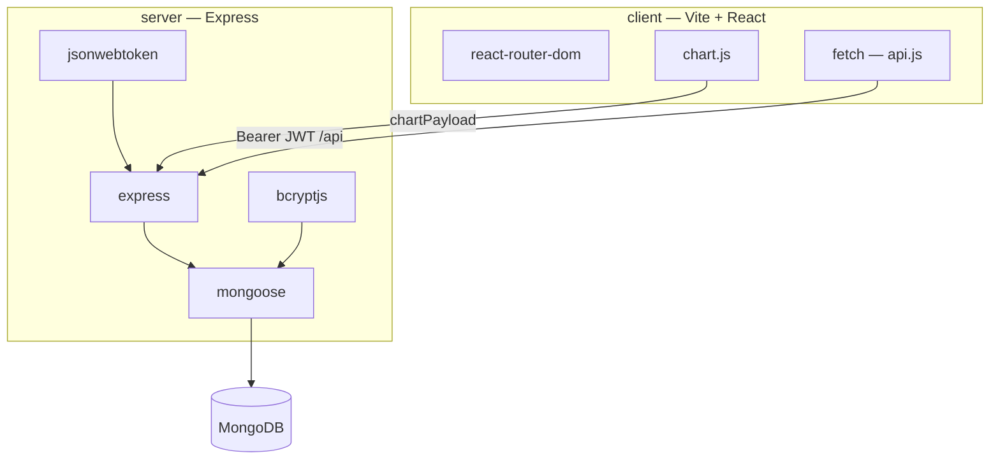

# Dependencies — Copyright Management

This document describes **libraries and packages** used in this project: what they are, where they are declared, and how they fit together.

The application is a **MERN** stack (MongoDB, Express, React, Node.js). Dependencies are managed with **npm workspaces** (`package.json` at the repo root plus `server/` and `client/`). There is **no PHP / Composer** in this tree.

For setup commands, see [README.md](README.md) and [USAGE.md](USAGE.md).

---

## 1. Stack at a glance

| Layer | Technology | Location / notes |
|-------|------------|------------------|
| **M** — MongoDB | Database 6+ | External install or Atlas; URI in `server/.env` |
| **E** — Express | HTTP API | `server/` — port **5000** (default) |
| **R** — React | SPA UI | `client/` — Vite dev server port **5173** |
| **N** — Node.js | Runtime | **18+** required (`package.json` `engines`); see `.nvmrc` |

```text
Browser (React + Chart.js)
    │  fetch /api  (+ Bearer JWT)
    ▼
Express (server)
    │  Mongoose
    ▼
MongoDB
```

---

## 2. How dependencies are organized

| Path | Role |
|------|------|
| `package.json` | Root workspace; dev orchestration (`concurrently`) |
| `server/package.json` | API runtime dependencies |
| `client/package.json` | UI runtime + Vite build tooling |
| `package-lock.json` | Locked versions (run `npm install` at root) |

**Install (from repo root):**

```bash
npm install
```

**Common scripts (root):**

| Command | Description |
|---------|-------------|
| `npm run dev` | API + React dev servers |
| `npm run build` | Production React build → `client/dist` |
| `npm start` | API serves `client/dist` and `/api` |
| `npm run seed` | Seed roles, permissions, admin, sample data |

---

## 3. Root workspace (`package.json`)

| Package | Type | Version (range) | Role |
|---------|------|-----------------|------|
| **concurrently** | devDependency | ^9.1.2 | Runs server and client together for `npm run dev` |

**Workspaces:** `server`, `client` — a single `npm install` at the root installs both packages.

---

## 4. Server (`server/package.json`)

| Package | Version (range) | Role in this project | Typical usage |
|---------|-----------------|----------------------|---------------|
| **express** | ^4.21.2 | HTTP server, `/api` routes, JSON body, static `client/dist` in production | `server/src/index.js`, `server/src/routes/*` |
| **mongoose** | ^8.9.5 | MongoDB ODM — schemas and models | `server/src/models/*`, `server/src/config/db.js` |
| **jsonwebtoken** | ^9.0.2 | JWT issue and verify for sessions | `server/src/middleware/auth.js`, auth routes |
| **bcryptjs** | ^2.4.3 | Password hashing and comparison | `server/src/models/User.js` |
| **dotenv** | ^16.4.7 | Load `server/.env` (URI, secrets, ports) | `import 'dotenv/config'` in entry/seed |
| **cors** | ^2.8.5 | Allow React dev origin with credentials | `server/src/index.js` (`CLIENT_URL`) |
| **morgan** | ^1.10.0 | HTTP request logging (`dev` format) | `server/src/index.js` |

### Node.js built-ins (not in `package.json`)

Used without an npm dependency:

- **`path`**, **`url`** — ES module `__dirname`, static paths for `client/dist`

### Server environment variables (related to packages)

Configure in `server/.env` (from `server/.env.example`):

- `MONGODB_URI` — MongoDB connection (Mongoose)
- `JWT_SECRET` — signing/verifying tokens
- `PORT` — API port (default 5000)
- `CLIENT_URL` — CORS origin (default `http://localhost:5173`)

### Not installed on the server (yet)

- **PDF export** — no Dompdf or similar; report PDF/CSV can be added on top of the REST API (see client `Reports.jsx` note).
- **File upload libraries** — not listed in `server/package.json` at time of writing.

---

## 5. Client (`client/package.json`)

### Runtime dependencies

| Package | Version (range) | Role in this project | Typical usage |
|---------|-----------------|----------------------|---------------|
| **react** | ^18.3.1 | UI components and state | `client/src/**/*.jsx` |
| **react-dom** | ^18.3.1 | DOM rendering | `client/src/main.jsx` |
| **react-router-dom** | ^6.28.2 | Client-side routing, protected routes | `client/src/App.jsx`, `ProtectedRoute.jsx` |
| **chart.js** | ^4.4.7 | Dashboard charts from API `chartPayload` | `client/src/pages/Dashboard.jsx` |

### Dev / build dependencies

| Package | Version (range) | Role |
|---------|-----------------|------|
| **vite** | ^5.4.11 | Dev server, production bundle to `client/dist` |
| **@vitejs/plugin-react** | ^4.3.4 | JSX and React Fast Refresh |

### Client patterns (no extra npm packages)

| Concern | Approach |
|---------|----------|
| HTTP API | Native **`fetch`** in `client/src/api.js` |
| Auth token | `localStorage` key `cm_token` |
| UI kit | No MUI, Bootstrap, or Tailwind in `package.json` — project CSS |
| Dev API proxy | Vite proxies `/api` → `http://localhost:5000` (`client/vite.config.js`) |

Optional: `VITE_API_URL` — override API base in `api.js` (defaults to `/api`).

---

## 6. External runtime (not npm)

| Component | Requirement | Notes |
|-----------|-------------|--------|
| **MongoDB** | 6+ | Local service or cloud URI; required for API and `npm run seed` |
| **Node.js** | >= 18.0.0 | Per root `package.json` `engines` |

---

## 7. Request and auth flow (how packages connect)

1. User signs in → server validates password with **bcryptjs**, returns **JWT** (**jsonwebtoken**).
2. Client stores token and sends `Authorization: Bearer <token>` on each **fetch** (`api.js`).
3. **express** routes use **requireAuth** / **requirePermission** → **mongoose** loads user, roles, permissions from **MongoDB**.
4. Dashboard requests stats; **chart.js** renders data from API `chartPayload` (**Dashboard.jsx** + `server/src/routes/dashboard.js`).



---

## 8. Offline installation (tooling, not app libraries)

The `offline_tools/` folder contains batch scripts to snapshot `node_modules` for air-gapped installs. That process vendors the **same npm packages** above; it does not add separate application libraries.

See `offline_tools/OFFLINE_README.txt` and [README.md](README.md) § Offline installation.

---

## 9. Quick reference — all declared npm packages

| Package | Workspace | prod / dev |
|---------|-----------|------------|
| concurrently | root | dev |
| bcryptjs | server | prod |
| cors | server | prod |
| dotenv | server | prod |
| express | server | prod |
| jsonwebtoken | server | prod |
| mongoose | server | prod |
| morgan | server | prod |
| chart.js | client | prod |
| react | client | prod |
| react-dom | client | prod |
| react-router-dom | client | prod |
| @vitejs/plugin-react | client | dev |
| vite | client | dev |

---

## 10. Updating this document

When adding or removing dependencies:

1. Update the relevant `package.json` and run `npm install` at the repo root.
2. Adjust the tables in §3–§5 and §9.
3. Note new usage in §4 or §5 (file paths and purpose).

Exact installed versions are in `package-lock.json` after install.
